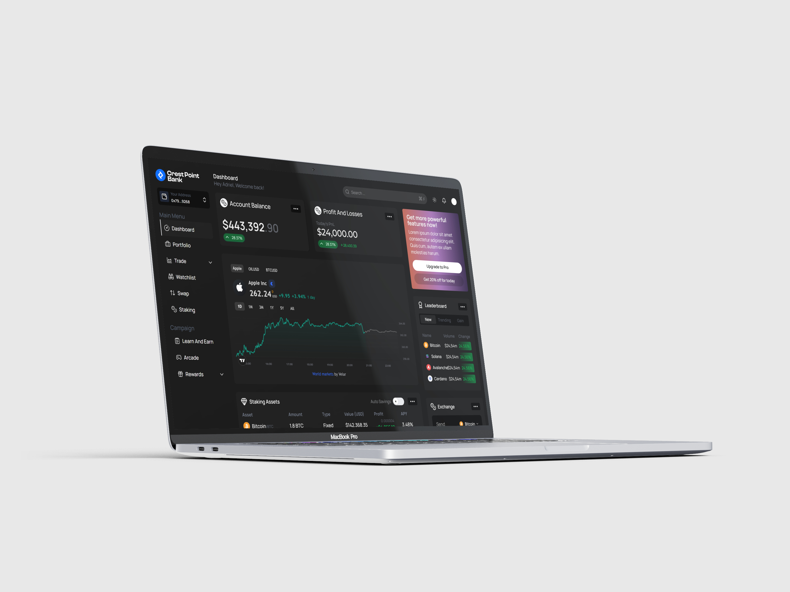

# Web3 Asset Management Dashboard

Multi-chain crypto portfolio interface with real-time wallet balance tracking and network switching.

🔗 **Live Demo:** [https://velar-brown.vercel.app/]



## 🎯 Project Overview

A clean, responsive dashboard for managing crypto assets across multiple blockchain networks. Built to demonstrate Web3 integration patterns and modern React architecture.

## ✨ Features

- 🔗 **Multi-Wallet Support:** MetaMask, WalletConnect, Coinbase Wallet, Rainbow
- 🔄 **Real-time Balance Tracking:** Automatic updates when wallet state changes
- 🌐 **Multi-Chain:** Ethereum, Polygon, BSC, Arbitrum, Optimism
- 📱 **Responsive Design:** Mobile-first, works seamlessly on all devices
- 🎨 **Clean UI:** Built with custom components and TailwindCSS

## 🛠 Tech Stack
- **Framework:** Next.js 14
- **Language:** TypeScript
- **Web3:** Wagmi v2, WalletConnect v2, Viem
- **State:** Zustand
- **Data Fetching:** Tanstack Query (Planned)
- **Styling:** TailwindCSS
- **Deployment:** Vercel

## 🚀 Quick Start
```bash
# Clone repository
git clone https://github.com/adriel-oloko/velar.git

# Install dependencies
npm install

# Set up environment variables
cp .env.example .env.local
# Add your WalletConnect Project ID

# Run development server
npm run dev
```

## 🔑 Environment Variables
```bash
NEXT_PUBLIC_WALLETCONNECT_PROJECT_ID=your_project_id_here
```

Get your Project ID from [WalletConnect Cloud](https://cloud.walletconnect.com/)

## 🎨 Key Components

### Wallet Connection
```typescript
// Uses RainbowKit for beautiful wallet connection modal
<ConnectButton />
```

### Balance Display
```typescript
// Real-time balance fetching with Wagmi hooks
const { data: balance } = useBalance({
  address: address,
  token: tokenAddress,
  watch: true, // Auto-update on changes
})
```


## 🔧 Features Breakdown

### Multi-Chain Support
- Ethereum Mainnet
- Polygon
- Binance Smart Chain
- Arbitrum
- Optimism
- Base

### Wallet Integrations
- MetaMask (Browser Extension + Mobile)
- WalletConnect (Mobile wallets)
- Coinbase Wallet
- Rainbow Wallet
- Trust Wallet (Browser Extension + Mobile)

## 📚 What I Learned
- **Wagmi v2 hooks architecture** - Cleaner, more composable than v1
- **WalletConnect v2 integration** - Improved mobile wallet support
- **Multi-chain state management** - Handling network-specific logic
- **Web3 error handling** - User-friendly messages for common failures
- **Gas estimation** - Calculating transaction costs across chains

## 🎯 Design Decisions

### Why Wagmi over ethers.js directly?
Wagmi provides React hooks that handle connection state, disconnection, network switching, and caching out of the box. Reduces boilerplate by ~70%.

### Why Zustand for global state?
Lightweight alternative to Redux for wallet-level state that needs to persist across components. Only 1KB vs Redux's 10KB+.

## 🐛 Known Issues / Roadmap
- [ ] Add token swap functionality
- [ ] Implement transaction history
- [ ] Add NFT gallery view
- [ ] Support more EVM chains
- [ ] Add price charts

## 📝 Notes

This dashboard demonstrates:
- Modern Web3 development patterns
- Clean component architecture
- Type-safe blockchain interactions
- Production-ready error handling

**Not included:** Backend, database, user authentication (frontend-only demo)

## 🤝 Contributing

This is a portfolio project, but feedback and suggestions are welcome via issues.

## 📄 License

MIT License - feel free to use this as reference for your own projects

---

**Built by Adriel Oloko** • [Portfolio](https://ad-portfolio-iota.vercel.app) • [LinkedIn](https://linkedin.com/in/adriel-oloko-115602203)
